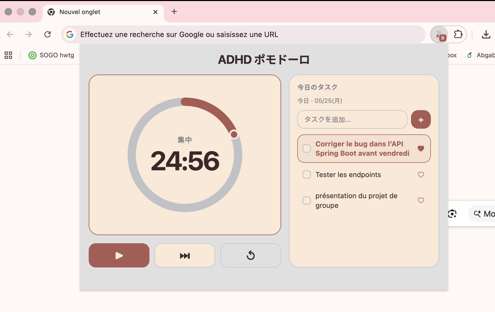

# ADHD Exam Pomodoro (Chrome Extension)

## 日本語

ADHDの勉強用に作った、シンプルなポモドーロChrome拡張です。

### できること

- フォーカス（作業）と休けいを自動で切り替えます。
- `Start` / `Pause` / `Resume` / `Skip` / `Reset` が使えます。
- ポップアップを閉じても、ツールバーのアイコンに残り時間が出ます。
- ブックマークバーにも `⏱ MM:SS` で時間を表示します。
- フェーズが終わるとデスクトップ通知を出します。
- 音を再生します（開始・フォーカス完了・フォーカス中の一時停止/再開/スキップ/リトライ）。
- 設定（作業時間、休けい時間、サイクル数）を保存します。

### 音ファイル

`assets/sounds/` に次の `mp3` を入れてください。

- `session-start.mp3`
- `focus-complete.mp3`
- `focus-pause.mp3`

### スクリーンショット

README用の画像は `assets/images/` に入れてください（例: `assets/images/screenshot1.png`）。



### Stack + Chromeで開く（1文）

この拡張は `Manifest V3 + Vanilla JavaScript (ES Modules) + Chrome APIs (alarms/storage/notifications/bookmarks/offscreen)` で作られていて、`chrome://extensions` でデベロッパーモードをONにして「パッケージ化されていない拡張機能を読み込む」からこのフォルダを選ぶと開けます。

### テスト

```bash
npm test
```

---

## English

This is a simple Pomodoro Chrome extension for ADHD-friendly study sessions.

### Features

- Automatically switches between focus and break phases.
- Supports `Start` / `Pause` / `Resume` / `Skip` / `Reset`.
- Shows remaining time on the toolbar extension icon even when popup is closed.
- Shows live timer text `⏱ MM:SS` in the bookmarks bar.
- Sends desktop notifications when a phase ends.
- Plays sounds for session start, focus complete, and focus pause/resume/skip/retry.
- Saves timer settings (focus, breaks, cycle count).

### Sound files

Put these `mp3` files in `assets/sounds/`:

- `session-start.mp3`
- `focus-complete.mp3`
- `focus-pause.mp3`

### Stack + Open in Chrome (one sentence)

This extension uses `Manifest V3 + Vanilla JavaScript (ES Modules) + Chrome APIs (alarms/storage/notifications/bookmarks/offscreen)`, and you open it by going to `chrome://extensions`, enabling Developer Mode, and loading this folder with “Load unpacked”.

### Test

```bash
npm test
```
